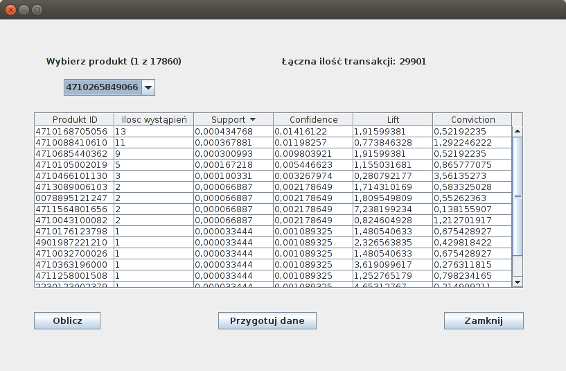

:doctype: book
:reproducible:
//:source-highlighter: coderay
:source-highlighter: rouge
:listing-caption: Listing
// Generowanie PDF: asciidoctor-pdf README.adoc

# Market Basket Analisys

### author: Marcin Dawidowski

Głównym założeniem projektu jest analiza kupowanych zestawów rzeczy za pomocą napisanego przez siebie algorytmu Apriori do odkrywania reguł asocjacyjnych.

#### Realizacja
Projekt został wykonany w języku Java. Aplikacja korzysta z bazy danych SQLite, w której przechowywane są dane. Aplikacja wyposażona została w interfejs graficzny,
w którym możliwy jest wybór produktu dla którego szukamy reguł asocjacyjnych.

=== Wygląd aplikacji

Reguły oceniane są pod względem różnych miar:

* support czyli wsparcie (łączne wystąpienia produktów/ilość wszystkich transakcji)
* confidence czyli wiarygodność (support pary produktów/support wybranego produktu)
* lift określa korelację pomiędzy zdarzeniami
  - Lift = 1 – zdarzenia niezależne
  - Lift < 1 – zdarzenia skorelowane negatywnie
  - Lift > 1 – zdarzenia skorelowane pozytywnie
* conviction czyli przekonanie. Jest to odwrotność wartości lift

Dodano takopcję sortowania odkrytych reguł wg każdej z użytych miar.
